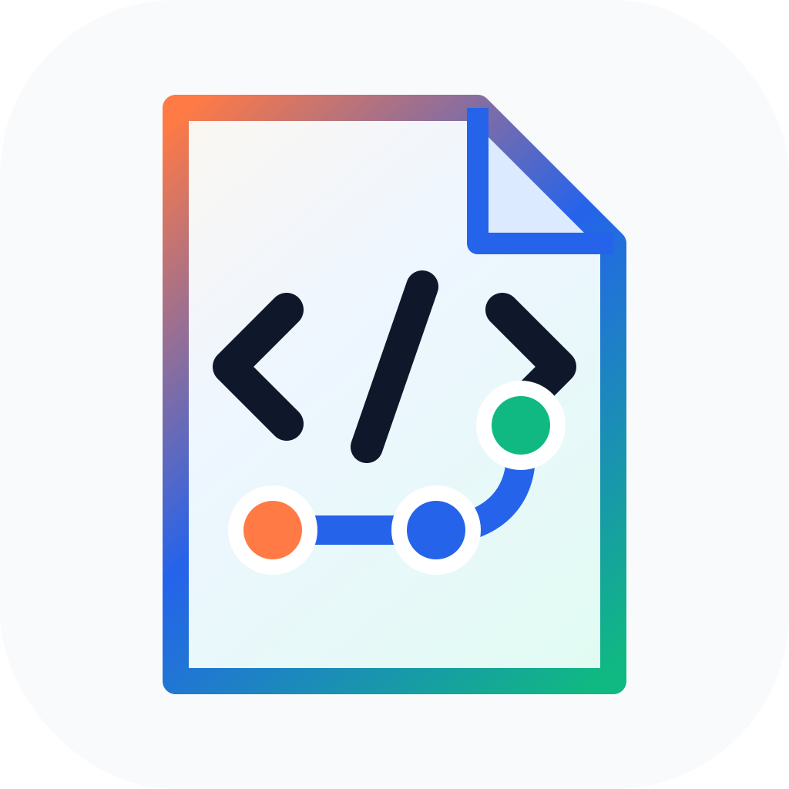
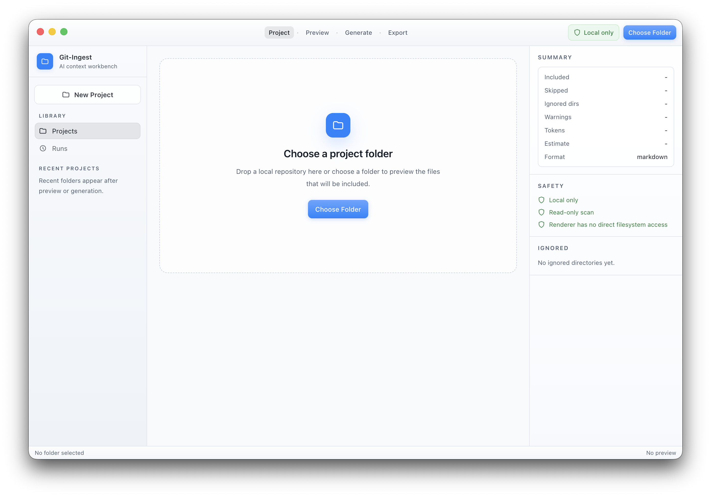
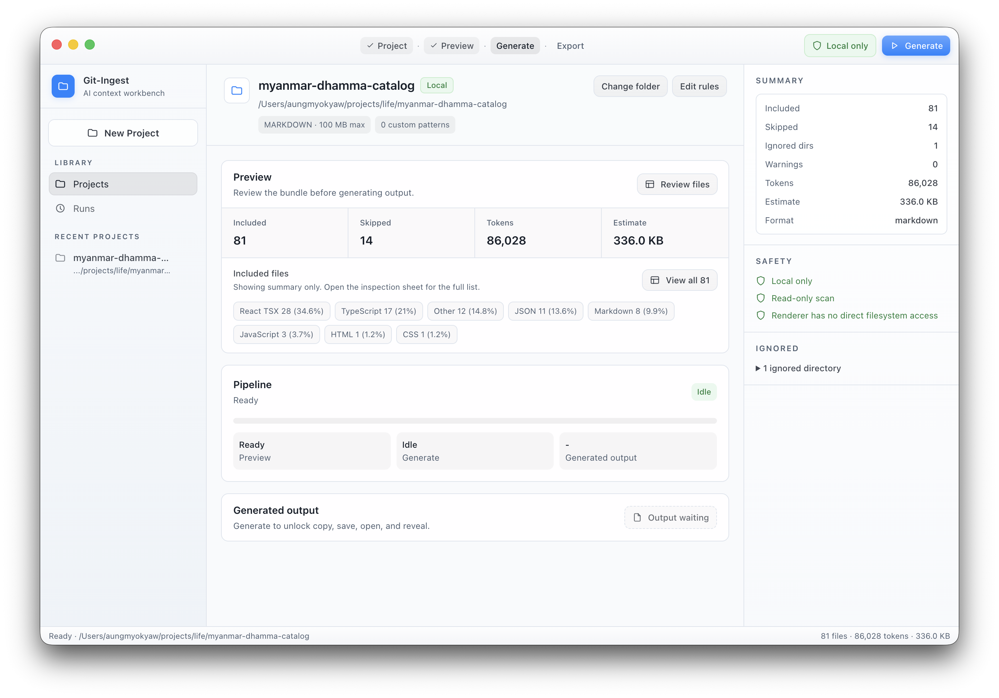
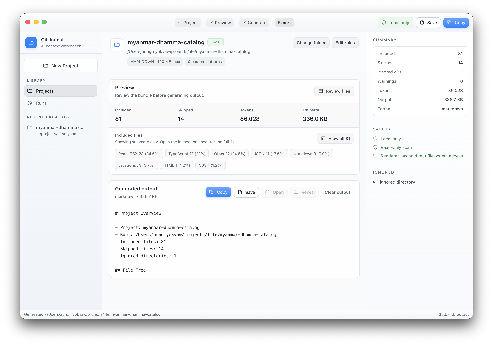
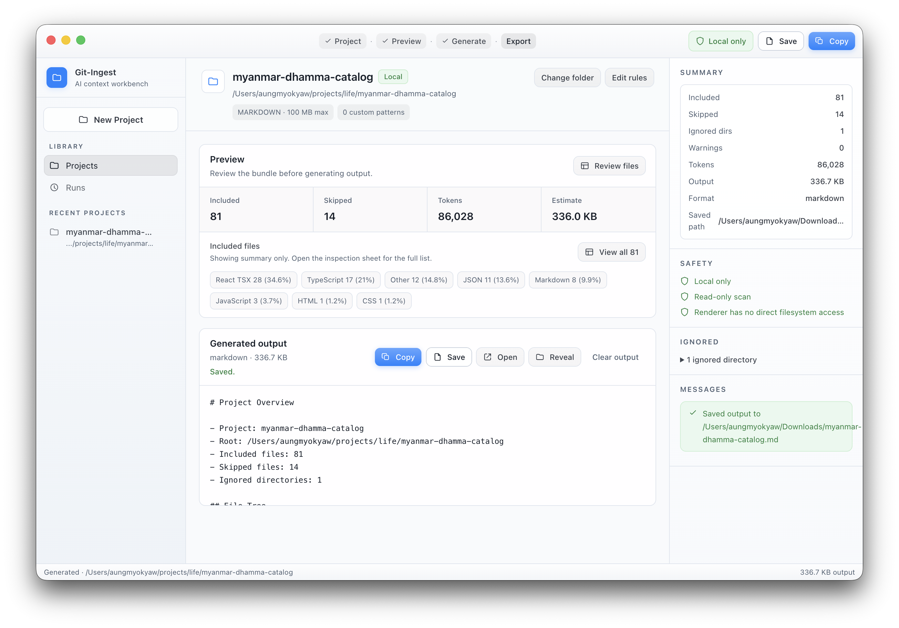

<p align="center">
  
</p>

<h1 align="center">Git-Ingest</h1>

<p align="center">
  <strong>Turn any project folder into clean, portable context for AI coding workflows.</strong>
</p>

<p align="center">
  <a href="#license"></a>
  <a href="https://github.com/AungMyoKyaw/git-ingest-desktop/releases"></a>
  <a href="https://bun.sh"></a>
  <a href="https://www.typescriptlang.org"></a>
  <a href="https://www.electronjs.org"></a>
  <a href="https://github.com/AungMyoKyaw/git-ingest-desktop/pulls"></a>
</p>

---

Git-Ingest scans a codebase, applies ignore and size rules, previews what will be included, and generates Markdown or plain text ready to drop into an LLM — all from a local-first desktop app. Project files stay on your machine; the renderer never gets direct filesystem access.

## ✨ Features

- **Choose a folder** — pick any local project from the desktop UI.
- **Preview before generating** — see included files, skipped files, ignored directories, estimated tokens, and output size at a glance.
- **Tune the output** — adjust format, include/exclude patterns, and max file size.
- **Generate & export** — produce AI-readable Markdown or plain text, copy it to the clipboard, save to disk, open the saved file, or reveal it in Finder.

## 🖥️ Product Screenshots

The desktop workflow in four steps:

<p align="center">
  
  
</p>
<p align="center">
  <em>Choose a project folder, then review the files and token estimate before generating.</em>
</p>

<p align="center">
  
  
</p>
<p align="center">
  <em>Generate AI-readable output, copy it, or save it locally for the next coding workflow.</em>
</p>

## 🧱 Workspace

This is a Bun monorepo with two packages:

| Package               | Purpose                                                                            |
| --------------------- | ---------------------------------------------------------------------------------- |
| `@git-ingest/core`    | Shared project scanning, ignore handling, token estimation, and output generation. |
| `@git-ingest/desktop` | Secure Electron desktop app built with Electron, React, and electron-vite.         |

## ✅ Requirements

- Node.js `>=22.12.0`
- Bun `>=1.1.0`

## 🍺 Install on macOS with Homebrew

First-time installation:

```bash
brew tap AungMyoKyaw/homebrew-tap
brew install --cask AungMyoKyaw/homebrew-tap/git-ingest
```

Upgrade an existing installation:

```bash
brew update
brew upgrade --cask AungMyoKyaw/homebrew-tap/git-ingest
```

## 🚀 Quick Start

```bash
bun install
bun run dev          # starts the desktop app
```

## ⚙️ Development Commands

```bash
bun test                 # Run core and desktop unit tests
bun run test:smoke       # Build and smoke-launch the desktop app
bun run build            # Build all workspace packages
bun run build:desktop    # Build only the desktop app
bun run package:desktop  # Build and package the desktop app
bun run format           # Format source, config, and docs
```

CI-oriented commands:

```bash
bun run ci:test
bun run ci:package:desktop
```

## 📦 Desktop Packaging

The desktop app uses `electron-builder`. The current package script produces macOS DMG and ZIP artifacts. The builder config also includes icons and target metadata for macOS, Windows, and Linux:

- macOS: `.icns`
- Windows: `.ico`
- Linux: `.png`

Unsigned local builds work without extra setup. For signed and notarized macOS releases, provide the standard `electron-builder` environment variables:

```bash
CSC_LINK
CSC_KEY_PASSWORD
APPLE_ID
APPLE_APP_SPECIFIC_PASSWORD
APPLE_TEAM_ID
```

## 🔒 Security Model

Git-Ingest keeps the desktop renderer isolated from Node and the filesystem.

- `contextIsolation` and sandboxed renderer execution are enabled.
- Node integration is disabled in the renderer.
- Filesystem access, folder selection, clipboard writes, save dialogs, file opening, and external links go through preload and main-process IPC.
- IPC payloads are validated before they reach core scanning or generation logic.
- External URLs are checked before opening through the OS shell.

## 🔁 Project Flow

The desktop workflow is intentionally tight:

```text
Choose Folder → Preview → Generate → Copy or Save
```

Preview is the confidence step. It shows what Git-Ingest plans to include before output is generated, so large folders, ignored files, binary files, and size limits are visible before anything is copied or saved.

## 📄 License

MIT © [Aung Myo Kyaw](https://github.com/AungMyoKyaw). See [LICENSE](LICENSE) for details.
