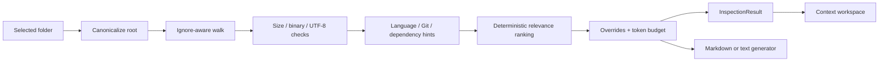

# Context Data Flow

```mermaid
flowchart LR
  Folder[Selected folder] --> Validate[Canonicalize root]
  Validate --> Walk[Ignore-aware walk]
  Walk --> Safety[Size / binary / UTF-8 checks]
  Safety --> Meta[Language / Git / dependency hints]
  Meta --> Rank[Deterministic relevance ranking]
  Rank --> Rules[Overrides + token budget]
  Rules --> Inspect[InspectionResult]
  Inspect --> UI[Context workspace]
  Rules --> Generate[Markdown or text generator]
```
