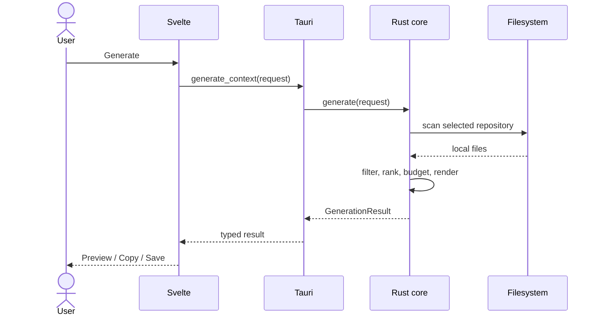

# Generation Sequence

```mermaid
sequenceDiagram
  actor U as User
  participant S as Svelte
  participant T as Tauri
  participant R as Rust core
  participant F as Filesystem
  U->>S: Generate
  S->>T: generate_context(request)
  T->>R: generate(request)
  R->>F: scan selected repository
  F-->>R: local files
  R->>R: filter, rank, budget, render
  R-->>T: GenerationResult
  T-->>S: typed result
  S-->>U: Preview / Copy / Save
```
