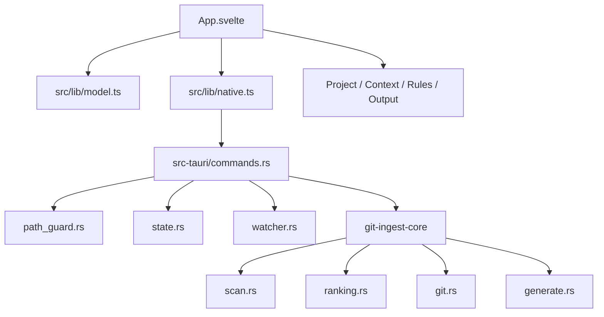

# Module Architecture

```mermaid
flowchart TB
  App[App.svelte] --> Model[src/lib/model.ts]
  App --> Client[src/lib/native.ts]
  App --> Views[Project / Context / Rules / Output]
  Client --> Commands[src-tauri/commands.rs]
  Commands --> Guard[path_guard.rs]
  Commands --> State[state.rs]
  Commands --> Watch[watcher.rs]
  Commands --> Core[git-ingest-core]
  Core --> Scan[scan.rs]
  Core --> Ranking[ranking.rs]
  Core --> Git[git.rs]
  Core --> Generate[generate.rs]
```
