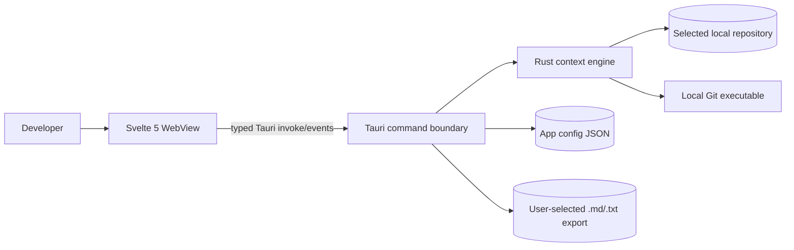

# System Context

```mermaid
flowchart LR
  User[Developer] --> UI[Svelte 5 WebView]
  UI -->|typed Tauri invoke/events| Boundary[Tauri command boundary]
  Boundary --> Core[Rust context engine]
  Core --> FS[(Selected local repository)]
  Core --> Git[Local Git executable]
  Boundary --> State[(App config JSON)]
  Boundary --> Export[(User-selected .md/.txt export)]
```

The renderer has no arbitrary filesystem or shell permission. Local repository data is not sent to a remote service.
